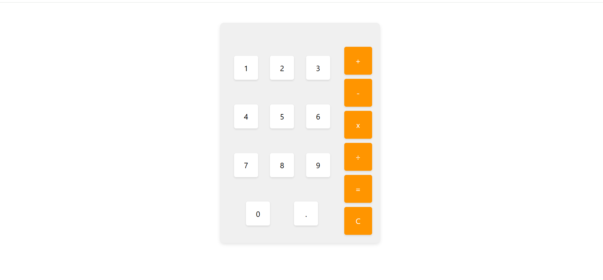

# 🧮 Web Calculator

A simple, responsive and interactive web calculator built with HTML, CSS and JavaScript.  
It performs basic arithmetic operations with a clean and intuitive interface.

---

## 🚀 Live Demo

Try it here:  
👉 https://gparej0.github.io/Calculator/

---

## 📸 Preview



---

## 📖 Description

This project is a basic web calculator designed to practice DOM manipulation and JavaScript logic.  
It allows users to perform fast calculations with a simple and user-friendly UI.

---

## ✨ Features

- Basic arithmetic operations: addition, subtraction, multiplication and division
- Decimal number support
- Clear button to reset calculations
- Clean and minimal UI design
- Responsive layout for different screen sizes

---

## 🛠️ Technologies Used

- HTML5
- CSS3
- JavaScript (Vanilla JS)

---

## 💻 Installation

Clone the repository:

```bash
git clone https://github.com/gparej0/Calculator.git
```

Open the project folder and run `index.html` in your browser.

---

## 📚 What I Learned

With this project I practiced:

- DOM manipulation
- Event handling in JavaScript
- Basic UI structuring
- Logic building for calculations
- Clean code organization

---

## 👤 Author

Guillermo  
GitHub: https://github.com/gparej0

---

## ⭐ Support

If you like this project, feel free to give it a star ⭐
